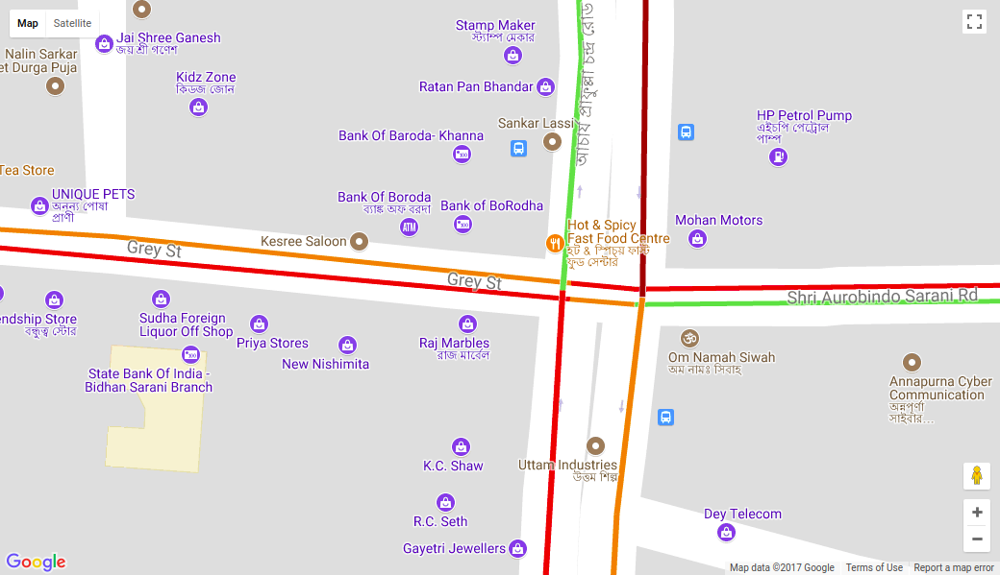

# dyretra_cv

### Sequence of roads

Sequence starts from right side roads to clockwise.

`road_data` gives data in pairs, ie, the first pair gives color coding for the roads on right side, ie, red and green

### Color Coding

`0` - Green

`1` - Orange

`2` - Red

`3` - Maroon
